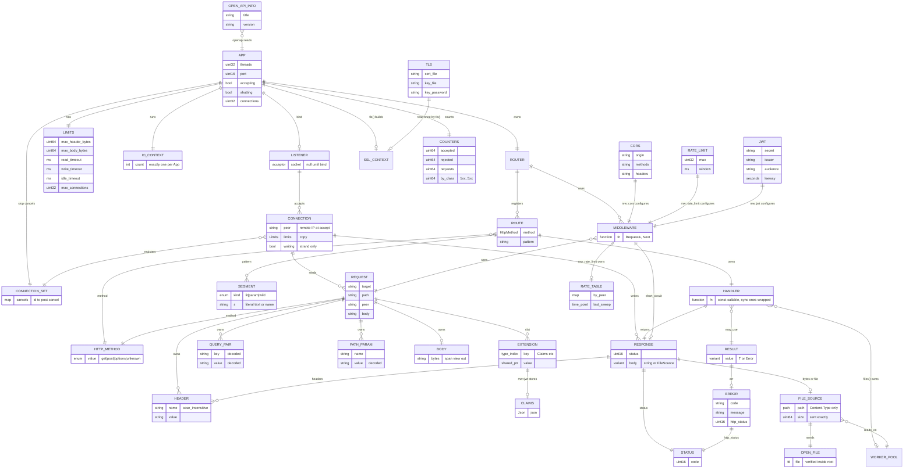
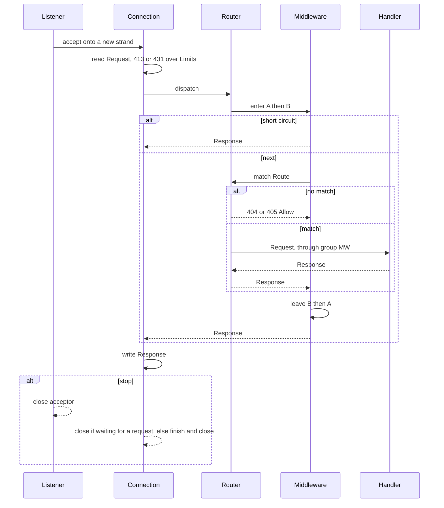

# ER — Hayate（エージェント向け）

[English](ER.md) | 日本語

英語版 [ER.md](ER.md) の訳。正本は英語版で、食い違えば英語版に従う。

正本は `docs/SPEC.md`。この図は **型と所有の関係** であり、RDB スキーマではない。
表に無い実体を作らない。受け入れは Phase 1、Phase 2（CORS / 静的ファイル / レート制限）、Phase 3（TLS /
JWT 検証 / OpenAPI 生成 / 最小 metrics / 静的ファイルのストリーミング送出）。multipart / WS / SSE / gzip は実装しない。

寿命の略: `App` = プロセス、`Conn` = TCP 接続、`Req` = 1 リクエスト。
view は所有しない。所有者より長く持たない。

## 実体の種類

| 種類 | 実体 |
|---|---|
| 公開の型（`include/hayate/`） | APP, ROUTER, LIMITS, TLS, REQUEST, RESPONSE, FILE_SOURCE, RESULT, ERROR, HTTP_METHOD, JWT, CLAIMS, CORS, RATE_LIMIT, OPEN_API_INFO |
| 公開の別名（`std::function`） | HANDLER, MIDDLEWARE |
| 内部の型（`src/`） | ROUTE, SEGMENT, CONNECTION, CONNECTION_SET, COUNTERS, OPEN_FILE, RATE_TABLE（`mw::detail`、MW が所有） |
| Asio / OpenSSL の型 | IO_CONTEXT, SSL_CONTEXT, WORKER_POOL（`asio::thread_pool`） |
| 型は無い（持ち方を図にしただけ） | LISTENER（acceptor と accept ループ）、HEADER、QUERY_PAIR、PATH_PARAM、BODY、EXTENSION、STATUS |

## 図

## 関係（エージェントが守ること）

| 左 | 多重度 | 右 | 所有 / 寿命 | 備考 |
|---|---|---|---|---|
| App | 1—1 | Router | App が所有 | 神オブジェクトを増やさない。根は App |
| App | 1—0..1 | Listener | App が所有 | `bind` で作る。型ではなく App の acceptor と、admin strand 上の accept ループ |
| App | 1—1 | IoContext | App が所有 | 1 つだけ。`threads(n)` は同じ io_context を n スレッドで回す |
| App | 1—1 | Limits | App が所有 | 常にある。既定値は SPEC |
| App | 1—0..1 | SslContext | App が所有 | `tls()` が `Tls` を読んで組む。`Tls` 自体は持たない |
| App | 1—1 | Counters / ConnectionSet | App が所有 | metrics と、`stop()` が要求待ちの接続を取り消すための登録簿 |
| Router | 1—* | Route | Router が所有 | GET / POST だけ。同じ形の二重登録と不正なパターンは登録時に投げる |
| Router | 1—* | Middleware | Router が所有 | onion。入り登録順、戻り逆順。App の `use` は 404/405 も包む。`group` の分はマッチした Route だけ |
| Route | 1—* | Segment | Route が所有 | `group()` は子の Router を持たず、連結したパターン（`//` を畳む）でルートを親に足す |
| Route | 1—1 | Handler | Route が値で所有 | `awaitable<Response>(Request&)`。const で呼べること。同期は内部で包む |
| Listener | 1—* | Connection | Listener が生成、Conn が自己寿命 | 上限超過は accept してすぐ閉じる。接続ごとに strand 1 本 |
| Connection | 1—* | Request | Conn が作る、Req 寿命 | keep-alive で連続。`peer` は accept 時に 1 回取る remote IP の写し |
| Request | 1—* | Header / Query / PathParam / Body | Request が所有 | アクセサは view を返す。欠けたものは空 view。`param` / `query` は復号済み、`path` は生 |
| Request | 0—* | Extension | Req 寿命の型付きスロット | グローバル状態の代替。同じ型の `set` は上書きし、前の参照は無効 |
| Handler | 1—1 | Response | 値で返す | 工場は `text` / `json` / `no_content` / `from_error` / `file`。`set_header` は名前を token 検査し値の CTL を落とす |
| Response | 0—1 | FileSource | Response が所有 | 本文は bytes か FileSource のどちらか。FileSource を作るのは `files()` だけ |
| FileSource | *—1 | WorkerPool | 共有 | `files()` のクロージャと FileSource が共有する。App より長く持たない |
| Middleware | 0—1 | Response | next を呼ばなければ短絡 | |
| Result | 0—1 | Error | 値 | `std::variant` の 1 実装。`std::expected` 禁止 |
| Error | 1—1 | Status | 値 | ハンドラ境界で例外を漏らさない |

一致の規則（優先順位・空セグメント・二重登録）は SPEC の「ルーティング」節に 1 箇所。
パス無し 404。メソッド違い 405 + Allow。

## リクエスト経路（同じ実体）

詳しい順序（TLS・100-continue・HEAD・ファイル送出）は `docs/UML.ja.md` のシーケンス。

## Phase 2 / 3 で受け入れた機能（実体は上の図にある）

| Phase | 機能 | 形 | ぶら下がる先 |
|---|---|---|---|
| 2 | CORS | `mw::cors(Cors)` | Middleware。preflight は 204 で短絡。固定 origin なら `Vary: Origin`。`mw::cors` が無ければ OPTIONS は 404 / 405 |
| 2 | 静的ファイル | `files(root, max_bytes = 0, io_threads = 2, fs_timeout = 5s)` | Handler。root 外・上限超過・不在・通常ファイル以外は 404。FS 待ちが `fs_timeout` を超えたら 503。FS 呼び出しは `files()` のワーカープール |
| 2 | レート制限 | `mw::rate_limit(RateLimit)` | Middleware。固定窓、`Request::peer` キー。`RateTable` は MW が mutex と一緒に持つ |
| 3 | TLS | `Tls{cert_file, key_file, key_password}` | App が `ssl::context` を組む。読めない・鍵が証明書と合わないと `tls()` が投げる。最低 TLS 1.2。設定したら全接続が TLS |
| 3 | JWT 検証 | `mw::jwt(Jwt)` | Middleware。HS256 のみ。`secret` が空・`leeway` が負なら投げる。正準でない base64url は 401。通れば `Claims` を Extension に置く |
| 3 | metrics | `metrics(App&)` | Handler。`Counters` は App が 1 つ持つ |
| 3 | OpenAPI | `openapi(const App&, OpenApiInfo = {})` | 関数。pattern と method だけから `Json` を作る。スキーマは出さない |
| 3 | ストリーミング送出 | `Response::file(FileSource)` | Connection が 64 KiB ずつ送る。`Content-Length` は stat の size |

`StaticFile` / `TlsContext` / `JwtAuth` / `OpenApi` / `Metrics` のようなクラスは作らない。

## 実装しない（SPEC の範囲外）

| Phase | 実体 | 理由 |
|---|---|---|
| 2 | Multipart / UrlEncoded | SPEC で実装しないと決めた |
| 2 | WebSocket / Sse | 同上 |
| 2 | Gzip | 同上 |

User / Session / ORM / Template は SPEC の範囲外。図に出さない。
