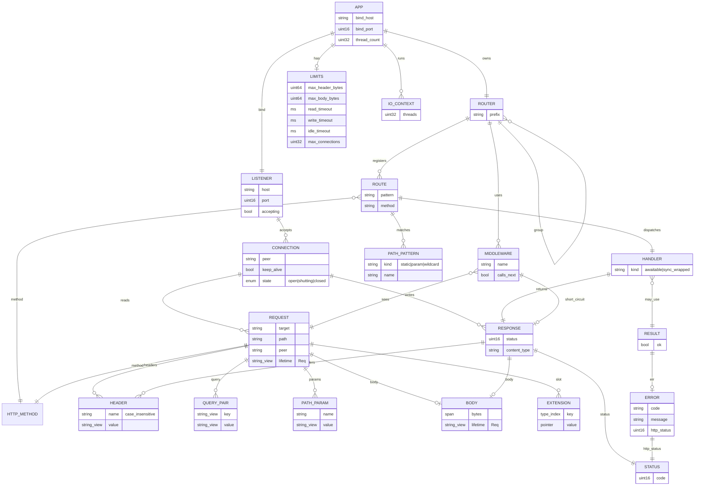
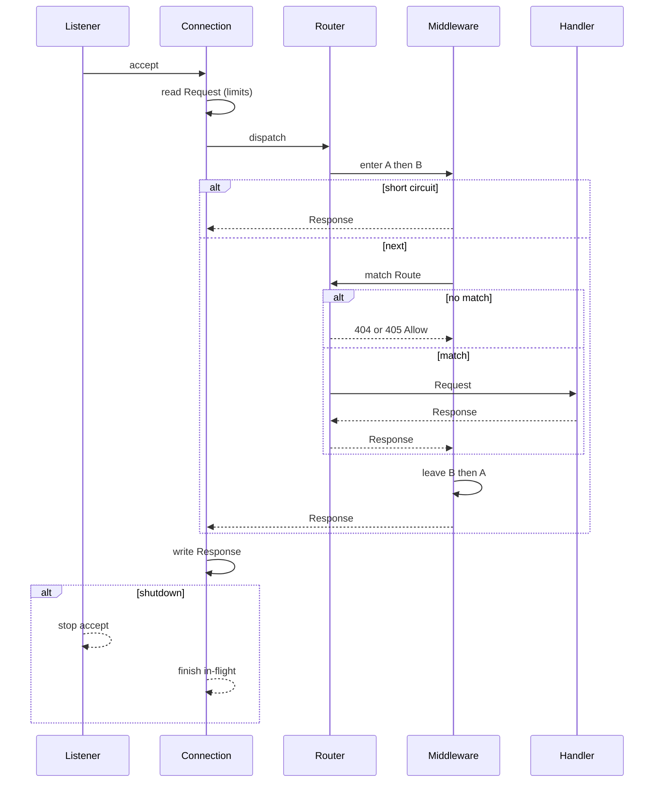

# ER — Hayate（エージェント向け）

正本は `docs/SPEC.md`。この図は **型と所有の関係** であり、RDB スキーマではない。
表に無い実体を作らない。受け入れは Phase 1 と CORS / 静的ファイル / レート制限まで。
残りの Phase 2 / 3 の実体は実装しない。

寿命の略: `App` = プロセス、`Conn` = TCP 接続、`Req` = 1 リクエスト。
view は所有しない。所有者より長く持たない。

## 実装対象（Phase 1 + CORS / 静的ファイル / レート制限）

後の 3 つは実体を増やさない。`Cors` と `RateLimit` は Middleware の設定値、
`files()` は Handler の工場。図はそのまま。

## 関係（エージェントが守ること）

| 左 | 多重度 | 右 | 所有 / 寿命 | 備考 |
|---|---|---|---|---|
| App | 1—1 | Router | App が所有 | 神オブジェクトを増やさない。根は App |
| App | 1—1 | Listener | App が所有 | `bind` の結果。shutdown で新規受付停止 |
| App | 1—* | IoContext | App が所有 | 基本 1。`threads(n)` で複数 |
| Router | 1—* | Route | Router が所有 | 静的 / `:param` / `*wildcard` |
| Router | 1—* | Middleware | Router が所有 | onion。入り登録順、戻り逆順。App の `use` は 404/405 も包む。`group` の分はマッチした Route だけ |
| Router | 1—* | Router | 親が所有 | `group`。接頭辞は連結、`//` を正規化 |
| Route | 1—1 | Handler | Route が所有 | `awaitable<Response>(Request&)`。同期は内部で包む |
| Listener | 1—* | Connection | Listener が生成、Conn が自己寿命 | 上限超過は新規拒否 |
| Connection | 1—* | Request | Conn が所有、Req 寿命 | keep-alive で連続。view の根拠。`peer` は accept 時に 1 回取る Conn の remote IP の写し |
| Request | 1—* | Header / Query / PathParam | 非所有 view | 欠けた param は空 view。`param` / `query` は復号済み、`path` は生 |
| Request | 0—1 | Body | 非所有 view | 超過は 413。JSON 破損・型不一致は 400 |
| Request | 0—* | Extension | Req 寿命の型付きスロット | グローバル状態の代替。最小 |
| Handler | 1—1 | Response | 値で返す | 工場は `text` / `json` / `no_content`。`set_header` は名前を token 検査し値の CTL を落とす |
| Middleware | 0—1 | Response | next を呼ばなければ短絡 | |
| Result | 0—1 | Error | 値 | `std::expected` 禁止。一方の実装だけ |
| Error | 1—1 | Status | 値 | ハンドラ境界で例外を漏らさない |

一致: パス無し 404。メソッド違い 405 + Allow。優先順位は ARCHITECTURE に 1 箇所。

## リクエスト経路（同じ実体）

## Phase 2 のうち受け入れ済み（実体は増えない）

| 機能 | 形 | ぶら下がる先 |
|---|---|---|
| CORS | `mw::cors(Cors)` | Middleware。preflight は 204 で短絡。固定 origin なら `Vary: Origin` |
| 静的ファイル | `files(root, max_bytes)` | Handler。root 外・上限超過・不在はどれも 404 |
| レート制限 | `mw::rate_limit(RateLimit)` | Middleware。固定窓、`Request::peer` キー |

`Cors` と `RateLimit` は設定値の struct。`StaticFile` クラスは作らない。

## Phase 2 / 3（書いてあるだけ。実体を足して実装しない）

| Phase | 実体 | ぶら下がる先 |
|---|---|---|
| 2 | RequestId / AccessLog / TimeoutMw | Middleware |
| 2 | Multipart / UrlEncoded | Body の解釈 |
| 2 | WebSocket / Sse | Connection の別モード |
| 2 | Gzip | Response 変換。Accept-Encoding があるときだけ |
| 3 | TlsContext | Listener |
| 3 | JwtAuth | Middleware。検証のみ |
| 3 | OpenApi | Router からの生成 |
| 3 | Metrics | App のカウンタ / ヒストグラム |

User / Session / ORM / Template は SPEC の範囲外。図に出さない。
