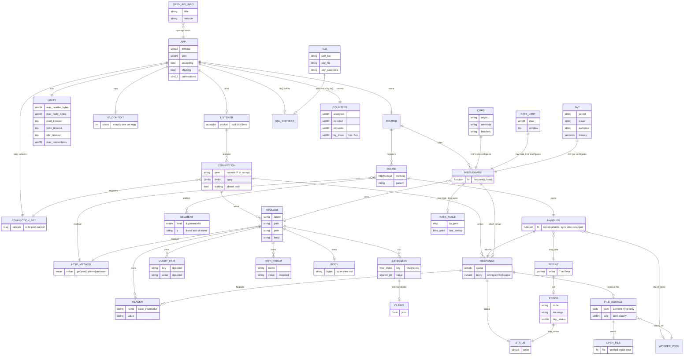
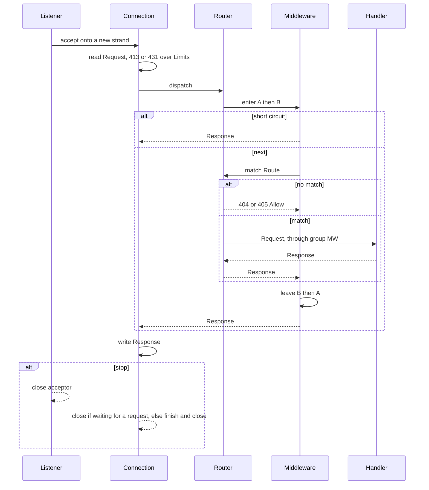

# ER — Hayate (for agents)

English (canonical) | [日本語](ER.ja.md)

The canonical source is `docs/SPEC.md`. This diagram shows **types and their ownership**; it is not an RDB schema.
Do not create entities that are not in the tables. Accepted: Phase 1, Phase 2 (CORS / static files / rate limiting), Phase 3 (TLS /
JWT verification / OpenAPI generation / minimal metrics / streaming of static files). Multipart / WS / SSE / gzip are not implemented.

Lifetime abbreviations: `App` = process, `Conn` = TCP connection, `Req` = one request.
Views do not own. Never keep one longer than its owner.

## Kinds of entity

| Kind | Entities |
|---|---|
| Public types (`include/hayate/`) | APP, ROUTER, LIMITS, TLS, REQUEST, RESPONSE, FILE_SOURCE, RESULT, ERROR, HTTP_METHOD, JWT, CLAIMS, CORS, RATE_LIMIT, OPEN_API_INFO |
| Public aliases (`std::function`) | HANDLER, MIDDLEWARE |
| Internal types (`src/`) | ROUTE, SEGMENT, CONNECTION, CONNECTION_SET, COUNTERS, OPEN_FILE, RATE_TABLE (`mw::detail`, owned by the middleware) |
| Asio / OpenSSL types | IO_CONTEXT, SSL_CONTEXT, WORKER_POOL (`asio::thread_pool`) |
| No type (only how things are held) | LISTENER (acceptor and accept loop), HEADER, QUERY_PAIR, PATH_PARAM, BODY, EXTENSION, STATUS |

## Diagram

## Relations (what agents must keep)

| Left | Multiplicity | Right | Ownership / lifetime | Notes |
|---|---|---|---|---|
| App | 1—1 | Router | owned by App | Do not add god objects. The root is App |
| App | 1—0..1 | Listener | owned by App | Made by `bind`. Not a type: the App's acceptor and the accept loop on the admin strand |
| App | 1—1 | IoContext | owned by App | Exactly one. `threads(n)` runs the same io_context on n threads |
| App | 1—1 | Limits | owned by App | Always present. Defaults are in the SPEC |
| App | 1—0..1 | SslContext | owned by App | `tls()` reads `Tls` and builds it. `Tls` itself is not kept |
| App | 1—1 | Counters / ConnectionSet | owned by App | For metrics, and the registry `stop()` uses to cancel connections waiting for a request |
| Router | 1—* | Route | owned by Router | GET / POST only. Duplicate shapes and malformed patterns throw at registration |
| Router | 1—* | Middleware | owned by Router | Onion: in registration order on the way in, reverse on the way out. App `use` also wraps 404/405. `group` ones apply only to matched Routes |
| Route | 1—* | Segment | owned by Route | `group()` keeps no child Router; it adds routes to the parent with the joined pattern (`//` collapsed) |
| Route | 1—1 | Handler | owned by value by Route | `awaitable<Response>(Request&)`. Must be const-callable. Sync ones are wrapped internally |
| Listener | 1—* | Connection | created by Listener, Conn owns itself | Over the limit: accepted and closed at once. One strand per connection |
| Connection | 1—* | Request | created by Conn, Req lifetime | Consecutive with keep-alive. `peer` is a copy of the remote IP taken once at accept |
| Request | 1—* | Header / Query / PathParam / Body | owned by Request | Accessors return views. Missing ones are empty views. `param` / `query` are decoded, `path` is raw |
| Request | 0—* | Extension | typed slot with Req lifetime | Replaces global state. `set` of the same type overwrites and invalidates earlier references |
| Handler | 1—1 | Response | returned by value | Factories are `text` / `json` / `no_content` / `from_error` / `file`. `set_header` token-checks the name and strips CTLs from the value |
| Response | 0—1 | FileSource | owned by Response | The body is either bytes or a FileSource. Only `files()` creates a FileSource |
| FileSource | *—1 | WorkerPool | shared | Shared by the `files()` closure and FileSources. Never kept longer than the App |
| Middleware | 0—1 | Response | short-circuits when next is not called | |
| Result | 0—1 | Error | value | A single `std::variant` implementation. `std::expected` is banned |
| Error | 1—1 | Status | value | Exceptions never leak across the handler boundary |

The matching rules (priority, empty segments, duplicates) live in one place: the "Routing" section of the SPEC.
No matching path is 404. A wrong method is 405 + Allow.

## Request path (same entities)

The detailed order (TLS, 100-continue, HEAD, file sending) is in the sequence in `docs/UML.md`.

## Features accepted in Phase 2 / 3 (their entities are in the diagram above)

| Phase | Feature | Shape | Hangs off |
|---|---|---|---|
| 2 | CORS | `mw::cors(Cors)` | Middleware. A preflight short-circuits with 204. `Vary: Origin` with a fixed origin. Without `mw::cors`, OPTIONS is 404 / 405 |
| 2 | Static files | `files(root, max_bytes = 0, io_threads = 2, fs_timeout = 5s)` | Handler. Outside root, over the limit, missing, or not a regular file is 404. Filesystem waits over `fs_timeout` are 503. Filesystem calls run on the `files()` worker pool |
| 2 | Rate limiting | `mw::rate_limit(RateLimit)` | Middleware. Fixed window keyed by `Request::peer`. The middleware holds `RateTable` together with a mutex |
| 3 | TLS | `Tls{cert_file, key_file, key_password}` | The App builds the `ssl::context`. `tls()` throws when a file is unreadable or the key does not match the certificate. TLS 1.2 minimum. Once set, every connection is TLS |
| 3 | JWT verification | `mw::jwt(Jwt)` | Middleware. HS256 only. Throws on an empty `secret` or a negative `leeway`. Non-canonical base64url is 401. On success puts `Claims` in an Extension |
| 3 | metrics | `metrics(App&)` | Handler. The App owns one `Counters` |
| 3 | OpenAPI | `openapi(const App&, OpenApiInfo = {})` | Function. Builds `Json` from pattern and method only. No schemas |
| 3 | Streaming | `Response::file(FileSource)` | The Connection sends 64 KiB at a time. `Content-Length` is the stat'ed size |

No classes like `StaticFile` / `TlsContext` / `JwtAuth` / `OpenApi` / `Metrics`.

## Not implemented (outside the SPEC)

| Phase | Entity | Reason |
|---|---|---|
| 2 | Multipart / UrlEncoded | The SPEC decided not to implement it |
| 2 | WebSocket / Sse | Same |
| 2 | Gzip | Same |

User / Session / ORM / Template are outside the SPEC. They do not appear in the diagrams.
