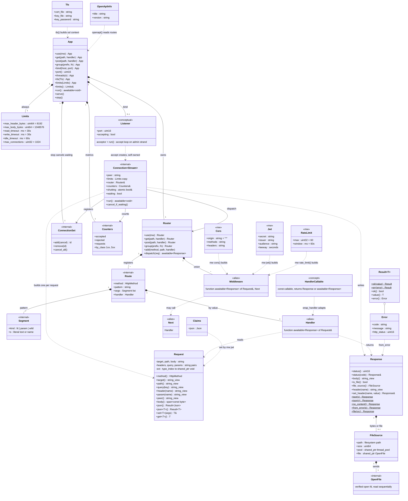
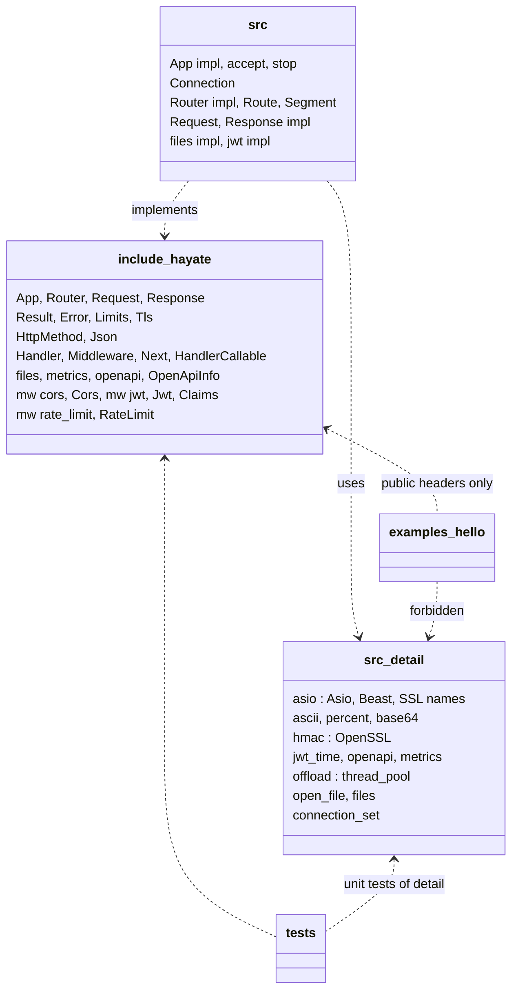
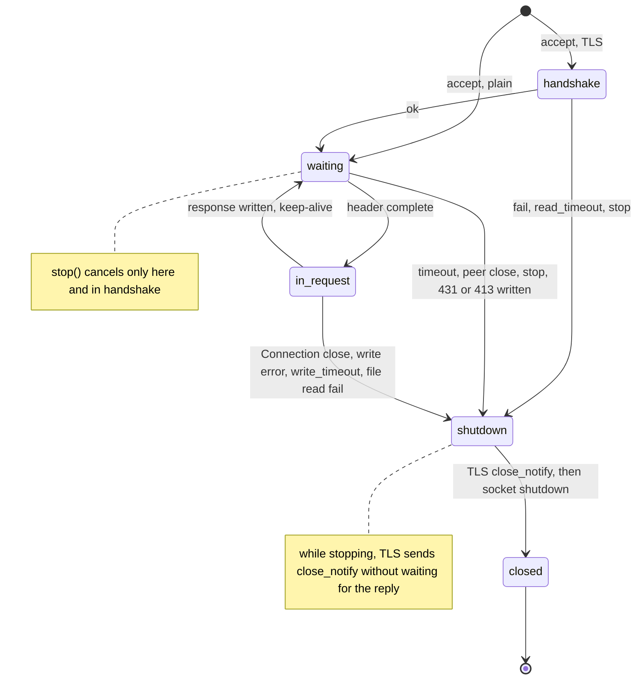
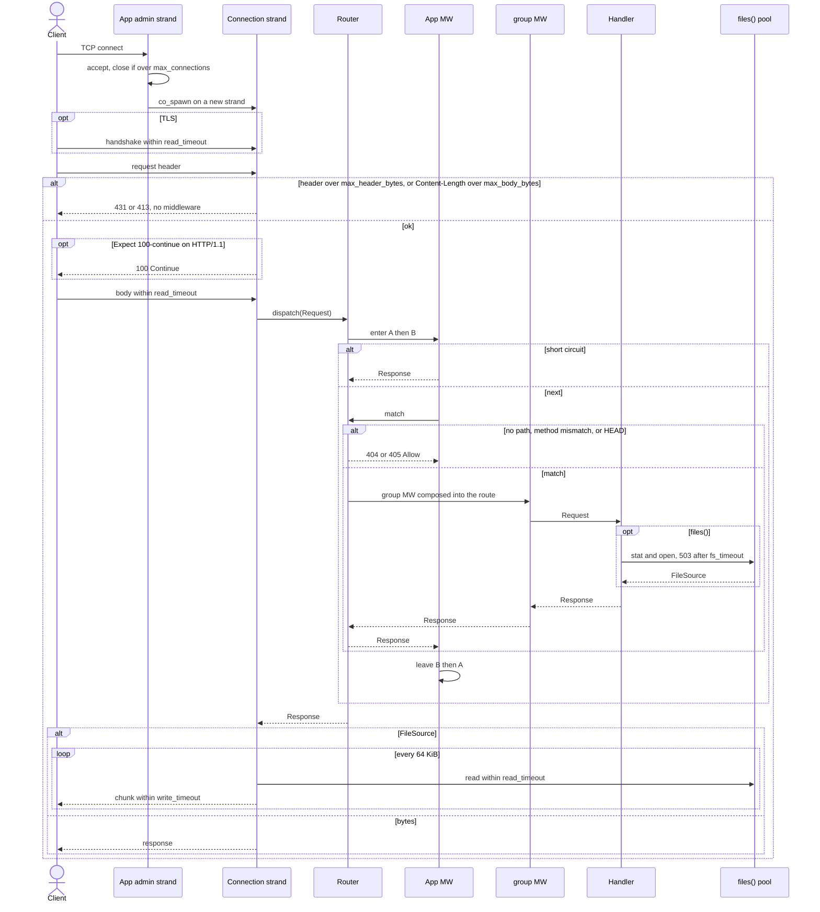

# UML — Hayate（エージェント向け）

[English](UML.md) | 日本語

英語版 [UML.md](UML.md) の訳。正本は英語版で、食い違えば英語版に従う。

正本は `docs/SPEC.md`。関係の正本は `docs/ER.md`。
ここに無い型・インタフェース・基底クラスを足さない。
受け入れは Phase 1、Phase 2（CORS / 静的ファイル / レート制限）、Phase 3（TLS / JWT 検証 / OpenAPI 生成 /
最小 metrics / 静的ファイルのストリーミング送出）。multipart / WS / SSE / gzip は実装しない。

図は Mermaid。注釈の意味:

| 注釈 | 意味 |
|---|---|
| なし | 公開 API の型（`include/hayate/`） |
| `<<mw>>` | 公開 API の型で、`hayate::mw` 名前空間にある（`mw::Jwt` など） |
| `<<alias>>` | `std::function` などの別名。独自の型ではない |
| `<<concept>>` | C++20 の concept |
| `<<internal>>` | `src/` の中の型。公開ヘッダに出ない |
| `<<conceptual>>` | 型は無い。持ち方を図にしただけ |

## クラス図

- 合成 `*--` は所有。Request は要求の文字列（target・ヘッダ・本文・param）を所有し、アクセサは view を返す。
  view を Response や App に保存しない
- `group()` は一時的な子の Router を作り、そのルートを子の MW で包んで親に足してから捨てる。
  Router は Router を持たない。接頭辞は連結して `//` を畳む
- Connection は `shared_ptr` と detached `co_spawn` で自分を持つ。App が持つのは接続の数と、`stop()` が
  取り消しに使う `ConnectionSet` だけ。接続ごとに strand を 1 本作り、その接続の I/O・タイマー・
  coroutine を載せる。accept ループと `stop()` は admin strand 1 本に載せる
- Handler と Middleware は利用者の関数オブジェクト。const で呼べること（`HandlerCallable`。`mutable` ラムダは
  コンパイル時に弾く）。同期のハンドラは `wrap_handler` が awaitable に包む。仮想基底を切らない
- 設定値の struct: `Limits` / `Tls` / `mw::Jwt` / `mw::Cors` / `mw::RateLimit` / `OpenApiInfo`。
  工場: `mw::cors()` / `mw::jwt()` / `mw::rate_limit()` が Middleware、`files()` / `metrics()` が Handler、
  `openapi()` が `Json` を返す。`ssl::context` は App の中にしか出てこない
- `Claims` を `Json` の別名にしないのは、Extension のキーが `typeid` で、別名だと他の `Json` と衝突するため
- `files(root, max_bytes, io_threads, fs_timeout)` のワーカープールは、返したクロージャと、返した
  `FileSource` が共有する。`FileSource` を作るのは `files()` だけ（`OpenFile` は公開しない）。
  プールを取り出して App より長く持たない
- `StaticFile` / `Service` / `TlsContext` / `Metrics` のようなクラスは作らない

## パッケージ

`include/hayate/rate_limit.hpp` の `mw::detail`（`RateTable` / `hit`）は、ヘッダだけの MW を作るために
公開ヘッダにあるが、API ではない。

## 接続の状態

- `waiting` の窓は、1 本目のヘッダ待ちが `read_timeout`、keep-alive の次のヘッダ待ちが `idle_timeout`。
  ヘッダが揃った後の本文読みは `read_timeout`
- timeout は閉じる。`shutting` を立てるのは `stop()` だけで、立っていれば次の要求を待たずに閉じ、
  書く応答には `Connection: close` を付ける
- `max_connections` を超えた接続は、Connection を作る前に accept してすぐ閉じる（応答は書かない）

## シーケンス（1 リクエスト）

- HEAD は本文を送らないが、`Content-Length` は本文を送った場合の値を付ける
- 1xx / 204 / 304 は本文も `Content-Length` も送らない
- ヘッダが 65533 バイトを超える応答は送れないので、Connection が 500 に差し替える（MW は通らない）

## エージェント向け制約（図から外さないこと）

- マクロで Route を登録しない
- `Router::add` は GET / POST だけ。同じメソッドの同じ形の二重登録、名前の無い `:` / `*`、途中の `*name` は
  登録時に `std::invalid_argument`。`:name` は空のセグメントに一致しない。完全一致は空の `*name` に勝つ
- パスはセグメントに分けてから復号する。`param()` / `query()` は復号後、`path()` は生
- `set_header` は token でない名前を捨て、値から CTL を落とす（ヘッダ注入を断つ）
- 例外は Handler / Middleware の境界を出ない。ハンドラの分は `dispatch_route`、MW の分は `dispatch` が
  受けて 500 にする
- Asio/Beast の失敗は、応答を書ける段階なら Error にして応答する（413 / 431 / 500）。書けない段階
  （timeout・相手の切断・handshake 失敗）なら閉じるだけで、受け取る側のない Error は作らない
- `std::expected` 禁止。`Result<T>` は `std::variant` の 1 実装
- Request の view を Response や App に保存しない
- 共有可変グローバルを置かない。状態は App か Request の Extension、または MW / Handler の工場が持つ
  もの（`rate_limit` の mutex 付き map、`files()` のプール）
- `stop()` が取り消すのは要求を待っている接続だけ。ヘッダが揃った要求は完了させる
- この図に無い基底（Service / Context / ApplicationBuilder）を足さない
- App の `use` は 404/405 を含む dispatch 全体を包む。`group` の MW はマッチした Route だけ
