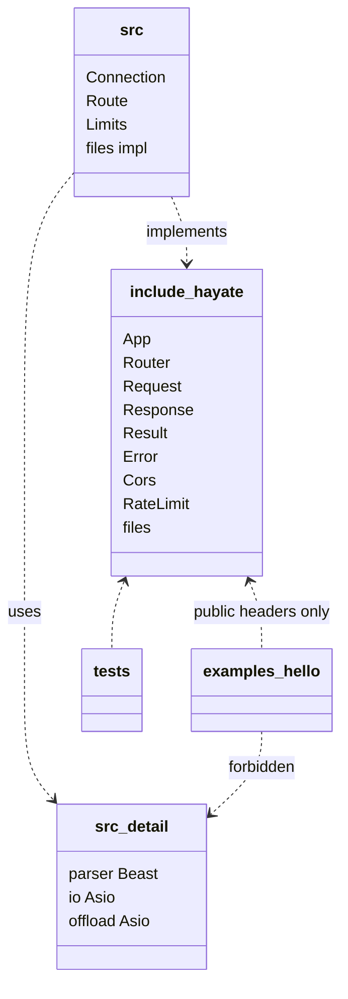
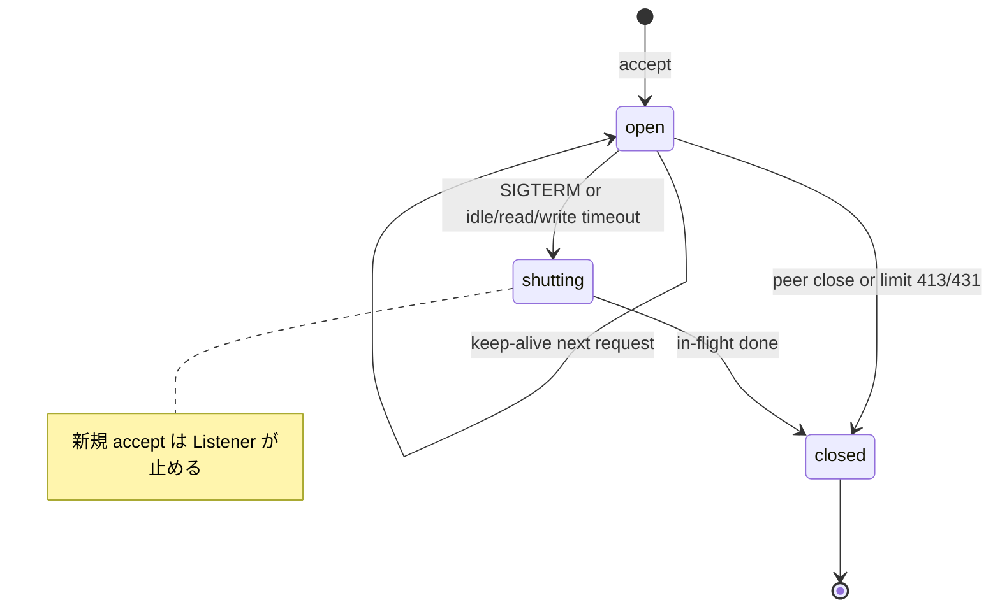
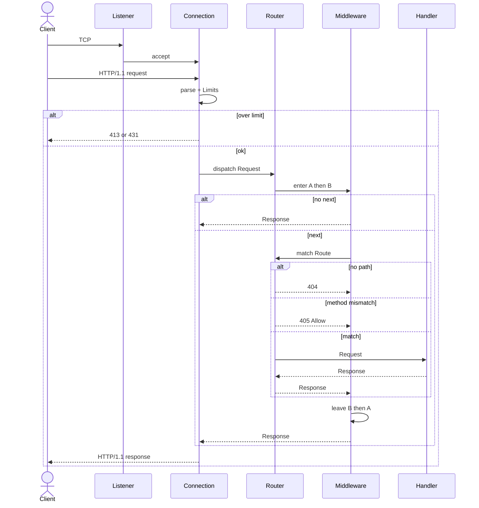

# UML — Hayate（エージェント向け）

正本は `docs/SPEC.md`。関係の正本は `docs/ER.md`。
ここに無い型・インタフェース・基底クラスを足さない。
受け入れは Phase 1 と CORS / 静的ファイル / レート制限まで。残りの Phase 2 / 3 は実装しない。

図は Mermaid。クラス名は公開 API の識別子。

## クラス図（Phase 1 + CORS / 静的ファイル / レート制限）

```mermaid
classDiagram
    class App {
        +use(mw) App
        +get(path, handler) App
        +post(path, handler) App
        +group(prefix, fn) App
        +threads(n) App
        +bind(host, port) App
        +run() awaitable~void~
    }

    class Router {
        +use(mw) Router
        +get(path, handler) Router
        +post(path, handler) Router
        +group(prefix, fn) Router
    }

    class Route {
        +method : HttpMethod
        +pattern : PathPattern
    }

    class PathPattern {
        +kind : static | param | wildcard
        +raw : string
    }

    class Middleware {
        +invoke(req, next) awaitable~Response~
    }

    class Handler {
        +call(req) awaitable~Response~
    }

    class Limits {
        +max_header_bytes : uint64
        +max_body_bytes : uint64
        +read_timeout : ms
        +write_timeout : ms
        +idle_timeout : ms
        +max_connections : uint32
    }

    class Listener {
        +host : string
        +port : uint16
        +accepting : bool
    }

    class Connection {
        +peer : string
        +keep_alive : bool
        +state : open | shutting | closed
    }

    class Request {
        +method() HttpMethod
        +target() string_view
        +path() string_view
        +query(key) string_view
        +header(name) string_view
        +param(name) string_view
        +peer() string_view
        +body() span~byte~
    }

    class Response {
        +status : uint16
        +text(s)$ Response
        +json(v)$ Response
        +no_content()$ Response
    }

    class Header {
        +name : string
        +value : string_view
    }

    class QueryPair {
        +key : string_view
        +value : string_view
    }

    class PathParam {
        +name : string
        +value : string_view
    }

    class Body {
        +bytes : span~byte~
    }

    class Extension {
        +key : type_index
    }

    class Result~T~ {
        +ok() bool
    }

    class Error {
        +code : string
        +message : string
        +http_status : uint16
    }

    class Cors {
        +origin : string
        +methods : string
        +headers : string
    }

    class RateLimit {
        +max : uint32
        +window : ms
    }

    App *-- Router : owns
    App *-- Listener : bind
    App *-- Limits : has
    Router *-- "*" Route : registers
    Router *-- "*" Middleware : onion
    Router *-- "*" Router : group
    Route *-- PathPattern
    Route o-- Handler : dispatch
    Listener o-- "*" Connection : accept
    Connection o-- Request : Req lifetime
    Connection o-- Response : write
    Request o-- "*" Header : view
    Request o-- "*" QueryPair : view
    Request o-- "*" PathParam : view
    Request o-- Body : view
    Request o-- "*" Extension : Req slot
    Handler ..> Request : reads
    Handler ..> Response : returns
    Middleware ..> Request : sees
    Middleware ..> Response : may short-circuit
    Result~T~ o-- Error
    Error --> Response : status
    Cors ..> Middleware : mw::cors() builds
    RateLimit ..> Middleware : mw::rate_limit() builds
```

合成 `*--` は所有。集約 `o--` は寿命が親に縛られるが、Request 配下の Header / Body は **非所有 view**。
`Handler` と `Middleware` は利用者の関数オブジェクトでよい。仮想基底を先に切らない。
`Listener` は独立した型ではない。App が持つ acceptor と `run()` の accept ループがその役。

CORS / 静的ファイル / レート制限は型を増やさない。`Cors` と `RateLimit` は設定値の struct で、
`mw::cors()` / `mw::rate_limit()` が Middleware を、`files(root, max_bytes, io_threads)` が Handler を返す。
`StaticFile` / `Service` のようなクラスは作らない。
`files()` のワーカープールは返されたクロージャが持つ所有物で、図の要素にはしない。

## パッケージ



## 接続の状態



## シーケンス（1 リクエスト）



## エージェント向け制約（図から外さないこと）

- マクロで Route を登録しない
- パスはセグメントに分けてから復号する。`param()` / `query()` は復号後、`path()` は生
- `set_header` は token でない名前を捨て、値から CTL を落とす（ヘッダ注入を断つ）
- 例外は Handler / Middleware の境界を出ない。Asio/Beast は Error に変換。
  ハンドラの分は `dispatch_route`、MW の分は `dispatch` が受けて 500 にする
- `std::expected` 禁止。`Result<T>` は 1 実装
- Request の view を Response や App に保存しない
- 共有可変グローバルを置かない。状態は App か Request の Extension
- この図に無い基底（Service / Context / ApplicationBuilder）を足さない
- App の `use` は 404/405 を含む dispatch 全体を包む。`group` の MW はマッチした Route だけ
